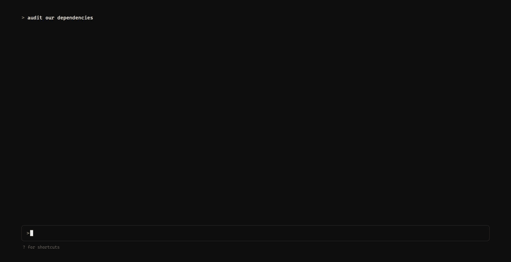

# speedread-skill

**Your AI agent reads the codebase. You speedread the report.**

 



Heavy AI workflows produce more prose than anyone wants to scroll through — audit reports, research summaries, migration writeups. This skill closes the loop: your coding agent writes the report as markdown, injects it into a single self-contained HTML file, and pops it open in your browser as an [RSVP](https://en.wikipedia.org/wiki/Rapid_serial_visual_presentation) speed-reader. One word at a time, fixed focal point, 300–1600 WPM. Most people comfortably double their reading speed within a session or two.

The reader isn't a dumb word-flasher. It understands markdown structure:

- **Headings** stream through the same anchor point in ALL CAPS and your focus color — a drum accent, not a full stop, so your eyes never have to refocus
- A **breadcrumb** shows where you are; `←`/`→` jump between sections
- **Bold** words run ~25% slower, `inline code` is held longer in monospace
- **Code blocks and tables** stop the stream and display whole until you continue
- Lists, paragraphs, and long words all get their own pause rules
- Press **D** anytime for a fully rendered document view

## Try it in ten seconds

Open [`reader.html`](reader.html) in a browser. It ships with a built-in demo document — press Space.

## Install

This is a skill in the [Anthropic Skills format](https://github.com/anthropics/skills): a folder with a `SKILL.md` your agent reads, plus the assets it needs.

**Claude Code** — clone into your skills directory:

```bash
# available in every project
git clone https://github.com/jordan-gibbs/speedread-skill ~/.claude/skills/speedread-report

# or just this project
git clone https://github.com/jordan-gibbs/speedread-skill .claude/skills/speedread-report
```

Then ask for it naturally — *"audit this repo and give me a report I can speedread"* — or invoke it directly with `/speedread-report`.

**Any other agent** (Cursor, Windsurf, custom) — point it at [`SKILL.md`](SKILL.md). The instructions are plain markdown: authoring rules for RSVP-friendly reports, an injection step, and an open-in-browser step. Any agent that can write files and run a shell command can follow them.

**No agent at all** — the injector works standalone:

```bash
python scripts/inject.py my-report.md --open
```

## How it works

1. **The agent writes the report** following the authoring rules in `SKILL.md` (conclusions first, a heading every 100–200 words, bold the load-bearing numbers). Reports written *for* RSVP read dramatically better than default LLM prose.
2. **The markdown is injected** into a copy of `reader.html` — a sentinel line gets replaced, `</script` sequences get escaped so code samples can't truncate the page.
3. **The file opens in your browser.** That's it. No server, no build step, no npm. The whole reader — markdown parser, pacing engine, settings UI — is one HTML file.

## Controls

| Key | Action |
| --- | --- |
| `Space` | Play / pause / continue past a block |
| `←` `→` | Previous / next section |
| `,` `.` | Skip back / forward 15 words |
| `R` | Restart |
| `D` | Toggle full document view |
| `Esc` | Pause (or close document view) |

Settings — speed (with 🔥 fire mode above 1200 WPM), font size, sentence pause, letter spacing, focus position, highlight color, five monospace fonts, dark mode — persist in `localStorage` between reports. A collapsible **Markdown Pacing** panel exposes the structural pacing rules too: heading slowdown, paragraph and list-item pauses, bold and code slowdown, and ramp-up length — all adjustable, all saved, one-click reset to defaults.

## Privacy

Your report never leaves your machine. The only network request the reader makes is a Google Fonts stylesheet, and it degrades gracefully to system fonts offline.

## Credits

The RSVP engine — ORP centering, sentence-end detection, WPM ramp-up — is a portable cousin of the reader at [speedread.life](https://speedread.life).

## Contributing

Issues and PRs welcome. The whole reader lives in one file (`reader.html`) on purpose — keep it dependency-free and self-contained, and it'll stay easy to audit and easy to ship.

## License

[MIT](LICENSE)
